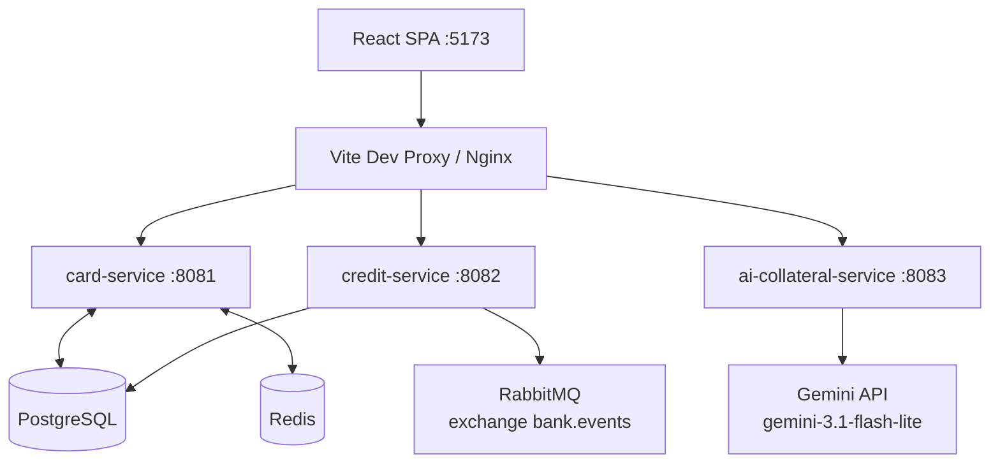

# ZBK Business Banking Self-Credit Demo Platform

Event-driven microservices demo for card lifecycle, credit scoring, and AI collateral
evaluation — showcasing contract-first APIs, RabbitMQ integration, and resilient Gemini Vision
calls in a Business Banking self-credit flow.

[](https://github.com/rimiray/bank-app-demo/actions/workflows/ci.yml)

## Live Demo

> **Public URL:** _pending Railway project link — see [docs/DEPLOY.md](docs/DEPLOY.md)._  
> Hosting target: **Railway** (Docker services + managed Postgres/Redis).  
> **RabbitMQ** uses **CloudAMQP Little Lemur** (free tier) — Railway has no free managed AMQP.

After deploy, open the frontend URL above: Cards / Credit & Collateral / Architecture tabs should work;
demo seed loads 3 cards and one approved credit application on empty databases.

## System Architecture



| Service | Stack | Port |
| --- | --- | --- |
| `card-service` | Kotlin, Spring Boot 3 | 8081 |
| `credit-service` | Java 21, Spring Boot 3 | 8082 |
| `ai-collateral-service` | Java 21, Spring Boot 3 | 8083 |
| Frontend dashboard | React + Vite + TypeScript (Nginx in Docker) | 5173 |

## Key Business Features

| Feature | Description | Service |
| --- | --- | --- |
| **Cards** | Issue cards, top-up, purchase (balance + credit limit / debt), close and delete with business guards | `card-service` |
| **Credit Scoring** | Annuity payment at configurable rate (default 8.5%), income-based approval, collateral-boosted limit; publishes `CreditCalculatedEvent` | `credit-service` |
| **AI Collateral Evaluation** | Photo to Vision appraisal via `gemini-3.1-flash-lite`; retry with backoff, then heuristic fallback so credit flow stays available | `ai-collateral-service` |

## Engineering Excellence & Process

| Document | What you will find |
| --- | --- |
| [Architecture ADR](docs/adr/0001-architecture-overview.md) | Contract-first polyglot services, event publish, AI model choice, and **explicit trade-offs** (Gateway, async gap, AI fallback, mobile) |
| [12-month Roadmap](docs/ROADMAP.md) | Q1–Q4 path from PoC to production (security/gateway, mobile BFF & KMP, risk/event sourcing, observability) |
| [Engineering Standards](docs/ENGINEERING_STANDARDS.md) | Definition of Done, target GitFlow, banking code-review checklist, testing pyramid |

**How we build today**

- **Contract-First** — `docs/api/openapi.yaml` (OpenAPI 3.0) is the source of truth; CI lints it (`contract-lint`).
- **Event-Driven** — `credit-service` publishes to RabbitMQ (`bank.events` / `credit.calculated`); card disbursement is still UI-orchestrated in the PoC (see ADR async gap → Roadmap Q3).
- **AI Resilience** — retry + heuristic fallback now; Circuit Breaker planned on the Roadmap (Q3).

## Quick Start

### 1. Prerequisites

- Docker Desktop (for the all-in-one stack)
- Optional for IDE runs: Java 21, Node.js 22+
- Copy secrets template and set a Gemini key (optional — without it, collateral uses heuristic fallback):

```bash
cp .env.example .env
# edit .env → GEMINI_API_KEY=...
```

`.env.example` uses **Docker network hostnames** (`postgres`, `redis`, `rabbitmq`) in `DB_URL` /
`REDIS_HOST` / `RABBITMQ_HOST`. For bare-metal `bootRun`, point those at `localhost` instead.

### 2. Full stack (one command)

```bash
docker compose up --build
```

| Surface | URL |
| --- | --- |
| Dashboard | http://localhost:5173 |
| card-service | http://localhost:8081 |
| credit-service | http://localhost:8082 |
| ai-collateral-service | http://localhost:8083 |
| RabbitMQ UI | http://localhost:15672 |

### 3. Alternative: local processes + Compose infra only

```bash
# Infra only (set DB/Redis/Rabbit hosts to localhost in .env first)
docker compose up -d postgres redis rabbitmq

cd services/card-service && ./gradlew bootRun          # :8081
cd services/credit-service && ./gradlew bootRun        # :8082
cd services/ai-collateral-service && ./gradlew bootRun # :8083
cd frontend && npm ci && npm run dev                   # :5173 (Vite proxy)
```

### 4. Verify

```bash
cd services/card-service && ./gradlew test
cd services/credit-service && ./gradlew test
```

CI on every push/PR to `main`/`develop`: [GitHub Actions workflow](.github/workflows/ci.yml).
